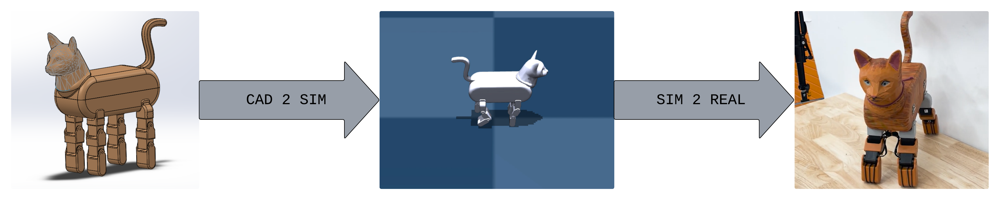
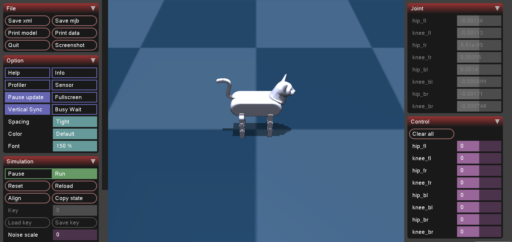

# The Catwalk 
Training a quadruped cat robot to walk using reinforcement learning



## Code Overview

### Robot Models
The `cat_model` directory contains all versions of the quadruped cat robot model. The `cad` subdirectory includes a solidworks assembly and the solidworks to urdf conversion of the model. The `urdf` subdirectory contains the final converted urdf from this cad model. The `mujoco_models` subdirectory has the mujoco compatible xml version of the robot. A python script to launch this model in mujoco is also present.

### Training Environment
The `cat_gym_env` directory contains the OpenAI gym training environment. The code setup for this environment is based on the [gymnasium documentation](https://gymnasium.farama.org/index.html) and the environment setup of the [half cheetah robot](https://github.com/openai/gym/blob/master/gym/envs/mujoco/half_cheetah.py).

## Usage

### Environment Setup
To isolate the training, everything is run from a Conda environment. With Anaconda installed, open the Anaconda prompt and run the following commands:
```
conda create -n catwalk python=3.10
conda activate catwalk
```
Install dependences to the active environment:
```
pip install -r requirements.txt
```
Clone the repository in the desired location:
```
git clone https://github.com/jessicaanz/Catwalk.git
```

### Open Robot Model
The cat robot model can be opened in an interactive mujoco simulation. Within the `catwalk` Conda environment, navigate to the directory where the git repo is located. From within the Catwalk directory, navigate to the mujoco models using the following command:
```
cd cat_model/mujoco_models
```
Launch the mujoco simulator using the following command:
```
python openmujoco.py
```
This should load a mujoco simulation window similar to the one shown below. The simulation view can be adjusted manually or within the GUI. The control torques of all motors can be adjusted using the sliders on the right side of the GUI.



### Run Trainings
The gym environment can be used to run an RL based training of walking motion. From within the main Catwalk directory, navigate to training environment using the following command:
```
cd cat_gym_env
```
Run the following command to install the environment:
```
pip install -e .
```
With the training setup, run the following command to train the walking motion:
```
python train_cat.py
```

### Simulate Results
After a training has successfully been completed, the results can be simulated using mujoco. Note that some trained policies are already present in the results directory. From within the `cat_gym_env` directory where the trainings were run, a zipped directory called `ppo_catwalk` should be generated. This contains the trained policy. Run the following command to simulate the policy:
```
python run_training.py
```
To simulate a different policy, simply replace the `ppo_catwalk` directory with the desired policy to simulate. Note that the `ppo_catwalk` files will be overwritten everytime a training is run. To save results, move the file to the results folder.